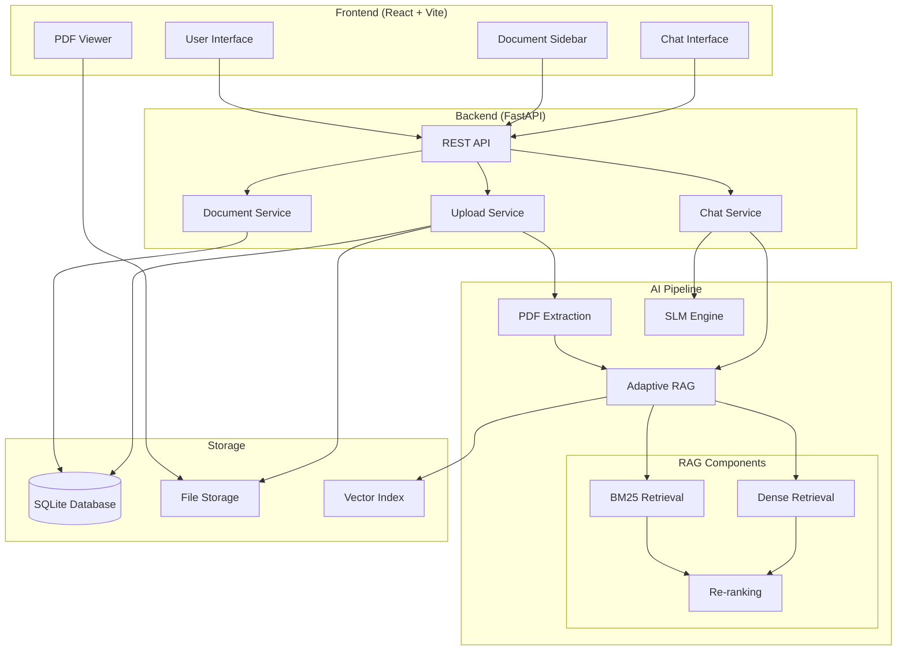
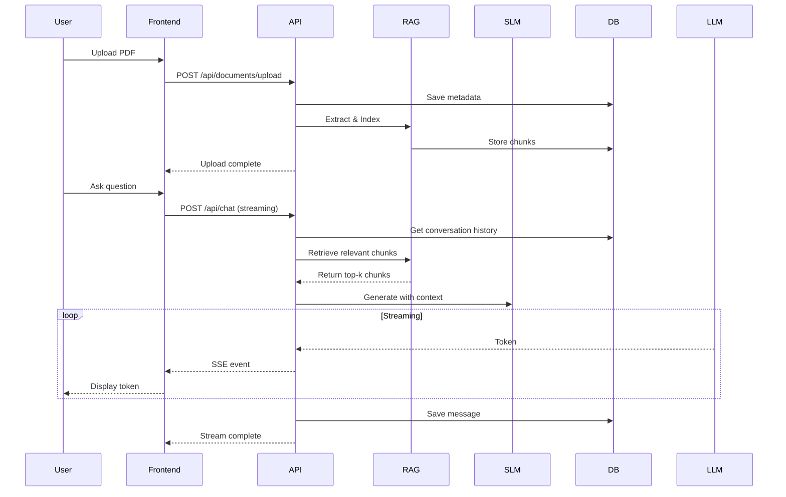
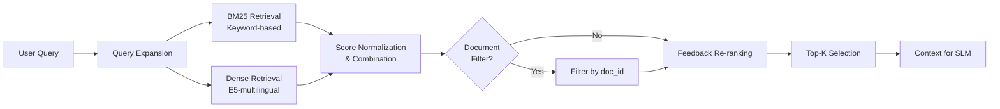

# 🤖 DocBot - AI-Powered Document Q&A System

An intelligent chatbot system that enables natural conversations with your PDF documents using advanced AI technologies including RAG (Retrieval-Augmented Generation) and SLM reasoning.


---

## 📋 Table of Contents

- [Features](#-features)
- [Architecture](#-architecture)
- [AI Pipeline](#-ai-pipeline)
- [Tech Stack](#-tech-stack)
- [Installation](#-installation)
- [Usage](#-usage)
- [Project Structure](#-project-structure)

---

## ✨ Features

### Core Capabilities
- 📄 **PDF Document Upload** - Support for multiple PDF files with intelligent extraction
- 💬 **Natural Language Chat** - ChatGPT-style conversational interface
- 🧠 **AI Reasoning Display** - Transparent thought process visualization
- 🎯 **Context-Aware Responses** - Answers based on document content
- 🌐 **Bilingual Support** - Vietnamese and English responses
- 📊 **Document Management** - Easy upload, view, and delete operations

### Advanced Features
- 🔍 **Adaptive RAG** - Hybrid BM25 + Dense retrieval with dynamic re-ranking
- 💡 **Chain-of-Thought** - Step-by-step reasoning before final answers
- 🎨 **Modern UI** - Dark theme with green accents and smooth animations
- ⚡ **Real-time Streaming** - Token-by-token response generation
- 📱 **Responsive Design** - Works on desktop, tablet, and mobile

---

## 🏗 Architecture

### System Overview



### Request Flow



---

## 🤖 AI Pipeline

### 1. Document Processing

```
PDF Document
    ↓
[PyPDF2 Extraction]
    ↓
Raw Text
    ↓
[Smart Chunking]
  - Chunk size: 1200 chars
  - Stride: 200 chars
    ↓
Text Chunks
```

### 2. Adaptive RAG System



**Key Components:**
- **BM25**: Sparse retrieval using keyword matching
- **Dense Retrieval**: Semantic search using `multilingual-e5-small` embeddings
- **FAISS Index**: Fast similarity search for dense vectors
- **Feedback Learning**: User feedback improves future retrievals
- **Dynamic Top-K**: Adaptive number of chunks based on query

### 3. SLM Generation

```
Context Chunks
    ↓
[Prompt Construction]
  - System: Instructions in Vietnamese
  - Context: Retrieved chunks
  - History: Last 3 messages
  - Query: User question
    ↓
[Qwen2.5-1.5B-Instruct]
  - Chain-of-Thought prompting
  - Structured output (reasoning + answer)
    ↓
[Streaming Parser]
  - Extract <reasoning>...</reasoning>
  - Extract <answer>...</answer>
    ↓
Real-time Display
```

**LLM Features:**
- **Model**: Qwen2.5-1.5B-Instruct (1.5 billion parameters)
- **Precision**: FP16 on GPU / FP32 on CPU
- **Context**: Up to 4096 tokens
- **Output**: Max 256 tokens with streaming
- **Temperature**: 0.7 for balanced creativity/accuracy

---

## 🛠 Tech Stack

### Frontend
- **Framework**: React 18 with Vite
- **Styling**: Vanilla CSS with custom design system
- **PDF Rendering**: react-pdf
- **Markdown**: react-markdown + remark-gfm
- **Icons**: lucide-react
- **Code Highlighting**: react-syntax-highlighter

### Backend
- **Framework**: FastAPI (Python 3.10)
- **Database**: SQLAlchemy with SQLite
- **LLM Engine**: Hugging Face Transformers
- **Vector Store**: FAISS
- **Text Retrieval**: rank-bm25
- **Embeddings**: sentence-transformers
- **PDF Processing**: PyPDF2 (fallback: mineru)

### AI/ML
- **SLM**: Qwen2.5-1.5B-Instruct
- **Embeddings**: intfloat/multilingual-e5-small
- **Retrieval**: Hybrid BM25 + Dense
- **Framework**: PyTorch + Transformers

---

## 🚀 Installation

### Prerequisites
- Python 3.10+
- Node.js 20.x+
- CUDA-capable GPU (optional, recommended)
- 8GB+ RAM

### Quick Start

1. **Clone the repository**
```bash
git clone https://github.com/yourusername/DocBot.git
cd DocBot
```

2. **Setup Python environment**
```bash
python -m venv venv
source venv/bin/activate  # On Windows: venv\Scripts\activate
pip install -r requirements.txt
```

3. **Install Node dependencies**
```bash
cd frontend
npm install
cd ..
```

4. **Run the application**
```bash
bash start.sh
```

The application will be available at:
- **Frontend**: http://localhost:5173
- **Backend API**: http://localhost:8000
- **API Docs**: http://localhost:8000/docs

---

## 📖 Usage

### 1. Upload Documents
- Click **"Upload PDF"** button in sidebar
- Select PDF file(s) to upload
- Wait for processing and indexing

### 2. Chat Modes

**Document-Specific Chat:**
- Click on a document in the sidebar
- Ask questions about that specific document
- Bot retrieves context only from selected document

**Global Chat:**
- Click on **"DocBot"** logo
- Ask questions across all uploaded documents
- Bot searches in entire knowledge base

### 3. View AI Reasoning
- Click the **lightbulb icon** on bot messages
- Expand to see step-by-step reasoning
- Understand how the bot arrived at the answer

### 4. Manage Documents
- **View**: Click on document to open PDF viewer
- **Delete**: Click trash icon to remove document
- **Refresh**: Documents auto-update on changes

---

## 📁 Project Structure

```
DocBot/
├── backend/                    # FastAPI backend
│   ├── app.py                 # Main application entry
│   ├── config.py              # Backend configuration
│   ├── models/                # Database models & schemas
│   │   ├── database.py        # SQLAlchemy models
│   │   ├── schemas.py         # Pydantic schemas
│   │   └── db_manager.py      # Database utilities
│   ├── routers/               # API endpoints
│   │   ├── upload.py          # Document upload
│   │   ├── chat.py            # Chat endpoints
│   │   ├── qa.py              # Q&A endpoints
│   │   └── admin.py           # Admin utilities
│   ├── services/              # Business logic
│   │   ├── chat_service.py    # LLM generation
│   │   ├── adaptive_rag.py    # RAG system
│   │   └── document_service.py
│   └── process/               # Document processing
│       ├── config.py          # Processing config
│       └── extract/           # PDF extraction
│           └── mineru.py      # Advanced extraction
├── frontend/                  # React frontend
│   ├── src/
│   │   ├── components/        # React components
│   │   │   ├── Sidebar.jsx    # Document sidebar
│   │   │   ├── ChatInterface.jsx
│   │   │   ├── Message.jsx    # Message display
│   │   │   ├── DocumentViewer.jsx
│   │   │   └── MessageInput.jsx
│   │   ├── services/          # API clients
│   │   │   └── api.js         # API service
│   │   ├── App.jsx            # Main app component
│   │   └── index.css          # Global styles
│   └── package.json
├── data/                      # Data storage
│   ├── uploads/              # Uploaded PDFs
│   ├── vector_store/         # FAISS indices
│   └── docbot.db             # SQLite database
├── start.sh                   # Startup script
├── requirements.txt           # Python dependencies
└── README.md                 # This file
```

---

## 🔧 Configuration

### Backend Config (`backend/process/config.py`)

```python
# LLM Settings
LLM = "Qwen/Qwen2.5-1.5B-Instruct"
MAX_CONTEXT_CHARS = 2500

# RAG Settings
CHUNK_CHARS = 1200
CHUNK_STRIDE = 200
TOPK_BM25 = 8
TOPK_EMB = 8
KEEP_TOPK = 6

# Embedding Model
EMB_MODEL = "intfloat/multilingual-e5-small"
```

### Environment Variables

Create `.env` file:
```env
# Optional settings
CUDA_VISIBLE_DEVICES=0  # GPU selection
PYTORCH_CUDA_ALLOC_CONF=expandable_segments:True
```

---

## 🎯 Features Roadmap

- [x] PDF document upload and processing
- [x] Adaptive RAG with hybrid retrieval
- [x] Chain-of-thought reasoning
- [x] Streaming responses
- [x] Document-specific and global chat
- [x] Vietnamese language support
- [ ] Multi-document comparison
- [ ] Export chat history
- [ ] Advanced analytics dashboard
- [ ] Multi-user support
- [ ] Cloud deployment

---

## 🤝 Contributing

Contributions are welcome! Please feel free to submit a Pull Request.

---

## 📄 License

This project is licensed under the MIT License - see the LICENSE file for details.

---

## 👨‍💻 Author

**Duong Hieu**
- GitHub: [@HieuAI2005](https://github.com/HieuAI2005)
- Email: hieuai0305@gmail.com

---

## 🙏 Acknowledgments

- Qwen Team for the excellent LLM models
- Hugging Face for the Transformers library
- FastAPI and React communities
- All open-source contributors

---
